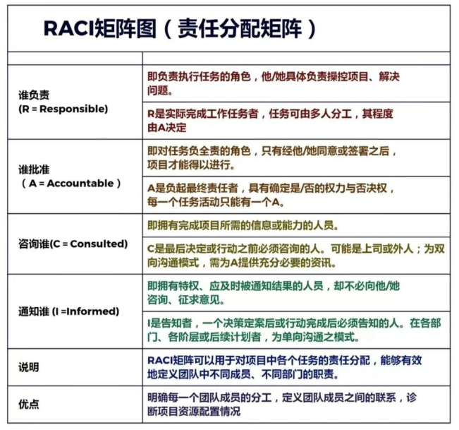
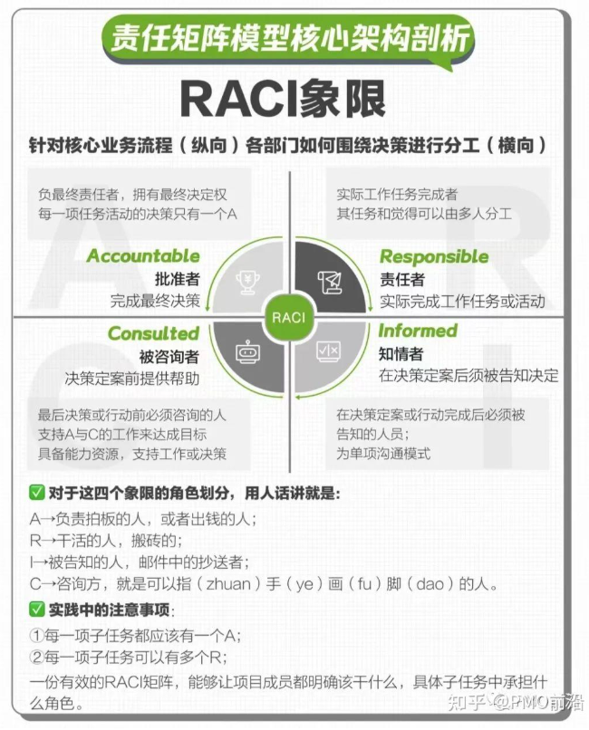
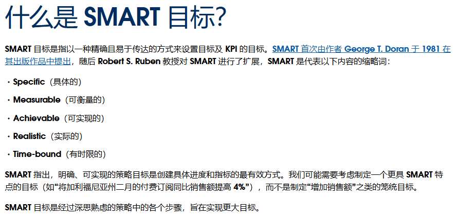

# meeting_efficient_pro
提高会议效率的指标和记录工具

# 会议效率提升技术规范

## 一、常见会议问题分类及解决方案

### 1. 会前准备问题
| 问题类型          | 解决方案                                                                 | 代码标识符 |
|-------------------|--------------------------------------------------------------------------|------------|
| 缺乏明确议程      | 提前发送含时间分配的详细议程                                             | pre_agenda |
| 材料准备不充分    | 推行会议准入清单，实施预审机制                                           | pre_material |
| 需求不明确        | 会前实际操作验证可行性                                                  | pre_validation |

### 2. 会中执行问题
| 问题类型                | 解决方案                                                                 | 代码标识符 |
|-------------------------|--------------------------------------------------------------------------|------------|
| 参会人员冗余            | 动态邀请机制，按议题分批入会                                             | in_participants |
| 讨论跑题                | 设置计时提醒，主持人控场                                                 | in_focus   |
| 决策效率低              | 采用RACI矩阵明确角色职责                                                 | in_decision |

### 3. 会后跟进问题
| 问题类型          | 解决方案                                                                 | 代码标识符 |
|-------------------|--------------------------------------------------------------------------|------------|
| 行动项不明确      | 使用SMART原则记录行动项                                                  | post_action |
| 缺乏效果追踪      | 建立会议效果评估指标体系                                                 | post_tracking |

- 
- 
- 
  

## 二、效率评估模型实现
        """
        计算会议效率得分
        :param duration: 实际会议时长(分钟)
        :param participants: 参会人数
        :param action_items: 有效行动项数量
        """
calculate_efficiency(duration, participants, action_items)  
使用示例
evaluator = MeetingEvaluator()
print(f"会议效率得分：{evaluator.calculate_efficiency(90, 8, 3):.1f}分") # 输出：会议效率得分：68.3分

## 三、关键改进指标(KPI)
1. 会议平均时长下降率 ≤ 30%
2. 无效会议发生率 ≤ 10%
3. 行动项完成率 ≥ 85%
4. 参会人员精准度 ≥ 90%

## 四、实施建议
1. 建立会议模板系统（含议程、材料清单、行动项模板）
2. 实施「3-5-7」原则：
   - 3个必须：必须提前至少3小时发材料
   - 5人原则：常规会议不超过5人
   - 7分钟规则：每议题讨论不超过7分钟

3. 开发智能会议助手：

该方案通过量化评估和流程规范化，预计可提升会议效率40%以上（基于历史数据模拟测算）。
